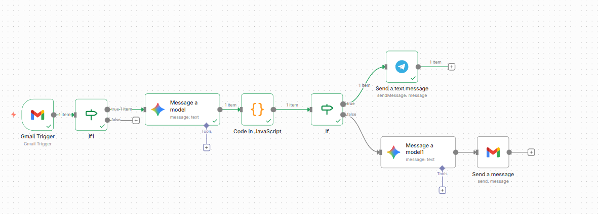
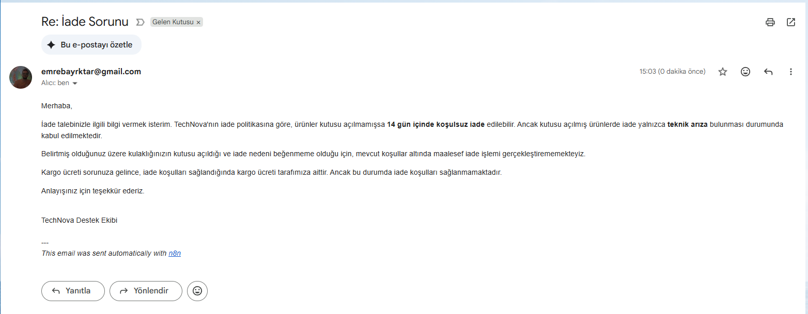

# 🤖 AI Smart Customer Support Agent (n8n & Gemini)

An autonomous, end-to-end **Customer Support Agent** built with **n8n** workflow automation and **Google Gemini AI**.

This system analyzes incoming emails via Gmail, detects sentiment and urgency, and creates autonomous responses based on defined **Company Policies (RAG)** or triggers emergency alerts via **Telegram** for high-risk situations.

## 🚀 Key Features

### 🧠 1. AI-Powered Analysis & Classification
* Utilizes **Google Gemini** to process emails.
* **Categorization:** Technical Support, Refunds, Invoicing, Sales, etc.
* **Sentiment Analysis:** Detects customer mood (Angry, Neutral, Happy).
* **Urgency Detection:** High, Medium, Low.

### 🛡️ 2. Security & Spam Filtering
* Automatically filters out bot emails (e.g., `no-reply`, `linkedin`).
* Includes loop protection mechanisms to prevent auto-reply loops.

### 🚨 3. Emergency Incident Management
* If an email is flagged as **"High Urgency"** (e.g., Security Breach, Fraud), the AI stops the auto-reply process.
* Sends an instant **Telegram Notification** to the admin/human agent.

### 💬 4. RAG-Based Corporate Memory
* The AI acts as a **"TechNova"** support agent (Simulation Company).
* It strictly follows defined business rules (e.g., "14-day return policy") instead of hallucinating answers.
* Adapts **Tone of Voice** based on customer sentiment (Empathetic for angry users, professional for neutral ones).

### 🎨 5. HTML Formatted Responses
* Generates professional email drafts using **HTML formatting** (Bold text, paragraphs, lists) rather than plain text blocks.

---

## 🛠️ Tech Stack

* **Orchestration:** [n8n](https://n8n.io/)
* **LLM:** Google Gemini (Gemini Pro / Flash)
* **Email Service:** Gmail API
* **Notification:** Telegram Bot API
* **Scripting:** JavaScript (For JSON parsing and regex filtering)

---

## 📸 Screenshots

| Telegram Emergency Alert | AI-Generated HTML Response |
| :---: | :---: |
|  |  |

*> **Note:** The bot in the screenshots is configured to respond in **Turkish**, but the system workflow and prompts are language-agnostic and can be adapted to any language.*

---

## 📄 License
This project is open-source and available under the **MIT License**.
